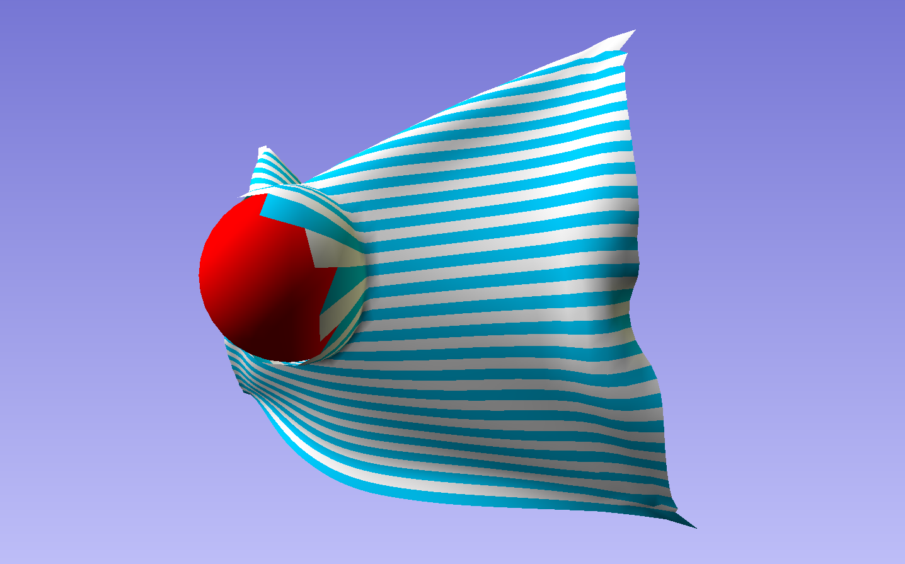

# Cloth-Simulator
Cloth Simulator built for the Game Physics course of the Game and Media Technology Master program.  
Created by Mark Berentsen (5511941) and Mark de Jong (5547717).

## Features
1. Cloth simulation by means of a mass spring system, including dampening.
2. Wind simulation by calculating wind forces per triangle.
3. Interaction with rigid spheres.
4. Tearable cloth based on maximum spring stretching (rather unstable at the moment).

## Controls
- Zoom in and out with + and - keys.
- Rotate around cloth with the mouse.
- Play/pause simulation with the spacebar.
- Reset the cloth with the R key.
- Make the cloth tearable/untearable with the T key, show tears or not with the S key.
- Enable/disable wind force and ball position with the W and B keys respectively.
- Use 1, 2, 3 and 4 to individually make the corners of the cloth static or dynamic.

## Build instructions
No further build instructions. 
Simply open the sln file to run the application in Visual Studio.

## Dependencies
All dependencies have been included in the "lib" folder.
